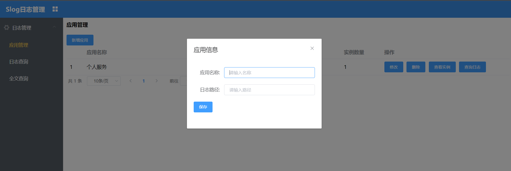
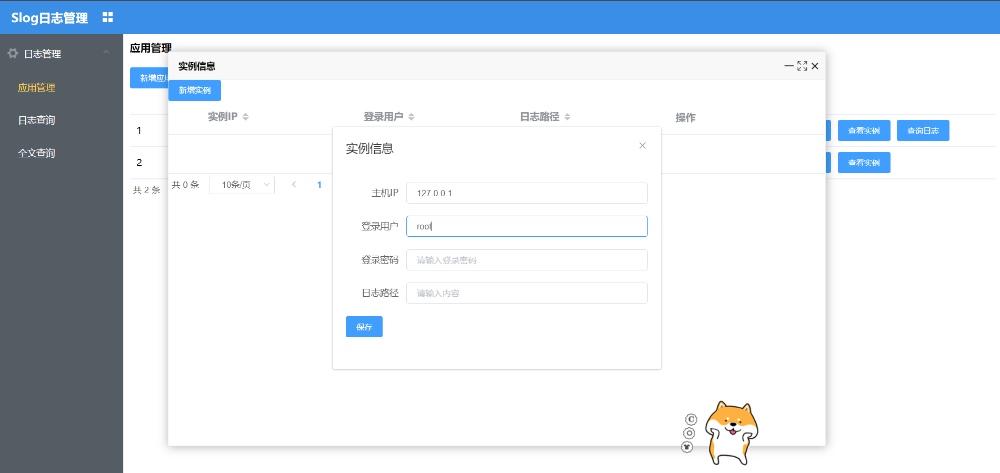
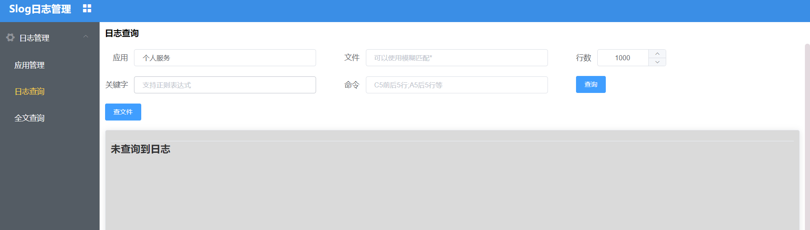
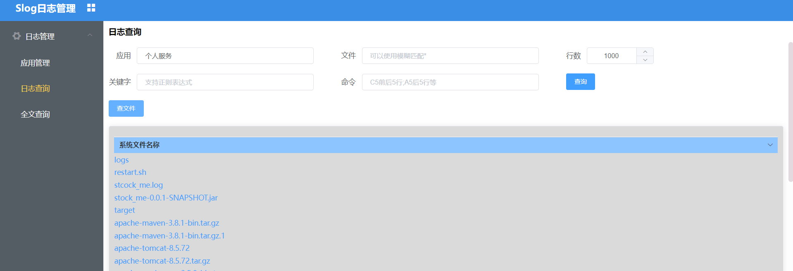
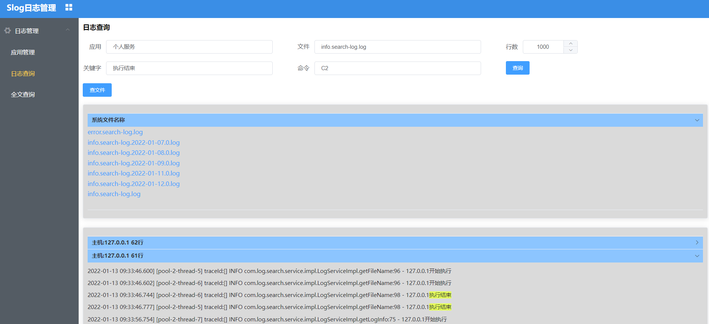
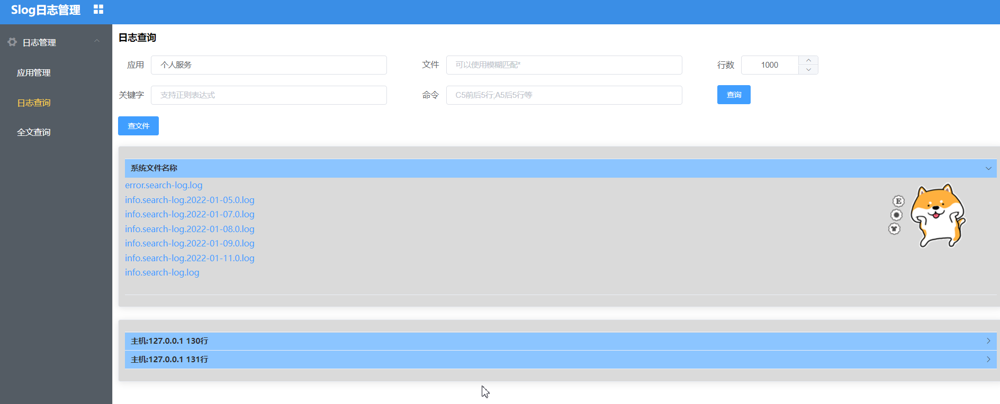
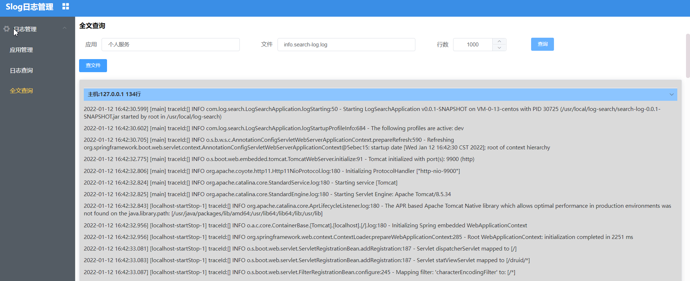

# Slog用于linux多实例多文件，批量日志查询，基于java+vue（elementUI），简单高效，服务超轻量化

##访问地址：http://162.14.116.178:9900

因为一些特殊原因，增加/删除/更新操作被我屏蔽了，日志文件也是后台写死的，但是代码里面没有写死，大家理解下

## 介绍
Slog解决的问题：

很多公司查询日志的特别不方便，10多个服务器，需要一个一个查，影响效率，所以写了Slog来解决这种查询的麻烦

### 1、为什么不用elk？

有的系统没有接入elk，而且elk查询日志一般只能单行查询，使用不是特别友好；

### 2、为什么不直接在linux上查询？

linux查询文件查询行数太多，很难找自己想找的东西，而且服务部署多个机器后，每个服务都需要查询一次日志，影响工作效率；

### 3、Slog的优势：

可以基于关键字进行多行查询，如关键字上下N行；

可以多服务器、多文件同时查询；

项目目前还存在一些问题需要后续优化：

1、搜索无校验；

2、搜索命令没有加命令过滤；

项目还在优化中......

## Slog使用介绍

模块：应用，实例，日志查询，全文查询
### 应用管理

应用界面：

新建应用：

查看实例->新建实例：

### 日志查询：

应用：之前创建的应用

文件：系统的文件名称

行数：文件的后N行

关键字：要查询的文字，也支持正则

命令：Cn行，上下n行，An，后n行，Bn前n行，参考linux命令

查询后对应的字段都会做缓存；以便于下次查询比较方便；

选择服务->查询文件：

点击文件->查询日志：

文件名称：info.search-log.log

关键词：执行结束

命令：C2

日志全文查询：

为了方便查询最新日志，所以提供后n行的查询

